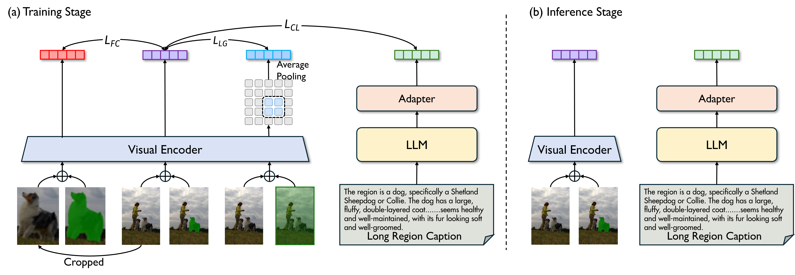
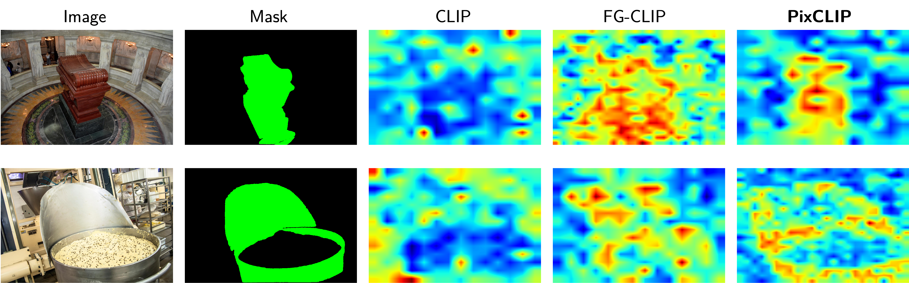

<div align="center">


<h1>PixCLIP (Masked-Image CLIP for Region-aware Evaluation)</h1>

[](https://arxiv.org/abs/2511.04601)
[](https://huggingface.co/HudeKing/PixCLIP_B_16/blob/main/PixCLIP_B16.pth)

</div>

This repository provides evaluation code for PixCLIP/PixCLIP style masked-image models, plus the minimal model code needed to run inference and retrieval/classification evaluations.

## News
- [2026-05] **PixCLIP: Towards Fine-grained Vision-Language Understanding via Any-granularity Pixel-Text Alignment** has been accepted to ICML 2026.

## Overview

<div align="center">
  
  <p><em>Overview of PixCLIP training and inference.</em></p>
</div>

<div align="center">
  
  <p><em>Qualitative text-image embedding similarity maps on two challenging examples (top: "an opened scroll on a dark wooden stand over black marble"; bottom: "a silver mixing bowl full of chocolate-chip batter with a metallic rim"). PixCLIP shows stronger fine-grained phrase-to-region alignment and more object-focused responses than CLIP and FG-CLIP.</em></p>
</div>

## Quickstart: Inference (Single Image + Mask)
This model expects an **RGB image** and a **single-channel mask** (white = keep). Example:

```bash
python - <<'PY'
import torch
from PIL import Image
from pixclip import create_model
from torchvision import transforms

ckpt = "PixCLIP_B16.pth"  # download from HF and place locally
device = "cuda" if torch.cuda.is_available() else "cpu"

model = create_model(
    model_name="EVA02-CLIP-B-16",
    force_custom_clip=True,
    pretrained=None,
    use_alpha_channel=True,
    pre_extract_feature=False,
).to(device).eval()
state = torch.load(ckpt, map_location="cpu")
model.load_state_dict(state, strict=False)

image = Image.open("image.jpg").convert("RGB")
mask = Image.open("mask.png").convert("L")

img_tf = transforms.Compose([
    transforms.ToTensor(),
    transforms.Resize((224, 224)),
    transforms.Normalize((0.48145466, 0.4578275, 0.40821073), (0.26862954, 0.26130258, 0.27577711)),
])
mask_tf = transforms.Compose([
    transforms.ToTensor(),
    transforms.Resize((224, 224)),
    transforms.Normalize(0.5, 0.26),
])

image_t = img_tf(image).unsqueeze(0).to(device)
mask_t = mask_tf(mask).unsqueeze(0).to(device)

texts = ["a photo of a dog", "a photo of a cat"]
with torch.no_grad():
    image_feat = model.encode_image(image_t, mask_t, normalize=True)
    text_feat = model.encode_text(texts, normalize=True)
    probs = (100.0 * image_feat @ text_feat.T).softmax(dim=-1)[0]
print({t: float(p) for t, p in zip(texts, probs)})
PY
```

## Evaluation
All evaluation entrypoints are under `eval/`. See `eval/README.md` for ready-to-run commands.

Supported datasets in this release:
- COCO masked classification
- DOCCI retrieval
- Flickr30k retrieval
- Urban1k retrieval
- RefCOCO zero-shot (ReCLIP-based)

## Repo Structure
- `eval/`: evaluation code and dataset-specific runners
- `pixclip/`: model implementation (CustomCLIP + configs)
- `pixclip_openclip_based/`: openclip-based CLIP wrappers
- `utils/`: shared helpers

## Notes
- Large datasets and checkpoints are **not** included in this repo.
- Masks are expected as single-channel images; white indicates the region of interest.
